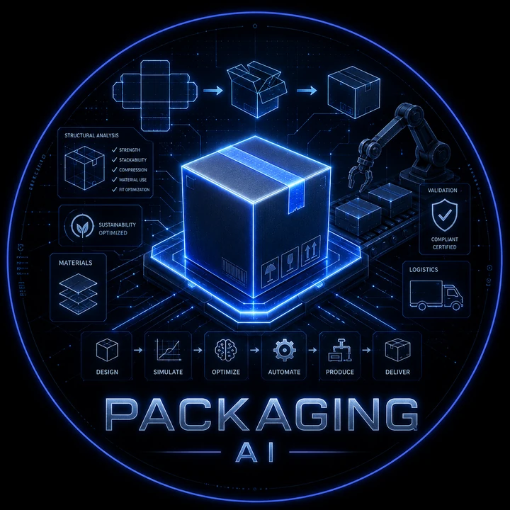
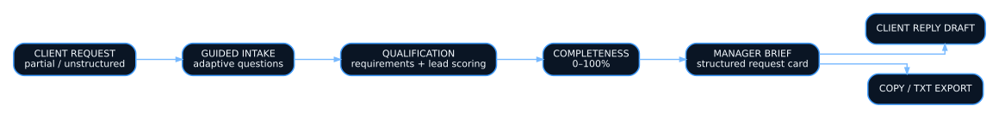

<p align="center">
  
</p>

<h1 align="center">Packaging Request Assistant</h1>

<p align="center">
  <strong>A guided manufacturing-intake prototype that turns incomplete packaging requests into structured manager-ready briefs.</strong>
</p>

<p align="center">
  
  
  
  
</p>

> This is an independent demonstration prototype. It is not an official project of any company, does not use internal company data and is not connected to corporate systems.

## The problem

Manufacturing requests often arrive incomplete: dimensions are missing, materials are unclear, print requirements are vague and the manager must reconstruct the real need through multiple messages.

This prototype demonstrates a better first step:

1. guide the client through a compact conversational intake;
2. ask only the clarifying questions relevant to previous answers;
3. show how complete the request is;
4. generate a structured brief for the manager;
5. prepare a clean reply to the client.

---

## Workflow

<p align="center">
  
</p>

---

## What the prototype demonstrates

- landing and positioning page;
- QR-friendly entry point;
- step-by-step chat interface;
- adaptive clarifying questions;
- request completeness score from 0 to 100%;
- structured manager card;
- manager notes and client reply draft;
- clipboard copy and `.txt` export;
- optional demo access code;
- Docker/VPS deployment path.

---

## Local development

Node.js LTS and `pnpm`/`npm` are required according to the project setup.

```bash
npm install
npm run dev
```

Open:

```text
http://localhost:3000
```

To stop the development server, press `Ctrl + C`.

---

## Demo access

The prototype supports an optional access code through an environment variable:

```dotenv
DEMO_ACCESS_CODE=pilot-2026
```

When the variable is omitted, the demo opens without a code.

The access code is a presentation convenience, not a security control. Do not place confidential, commercial or personal data inside the public demo.

---

## Deployment

### Vercel

1. import the GitHub repository;
2. keep the default Next.js settings;
3. add `DEMO_ACCESS_CODE` when a closed demonstration is preferred;
4. deploy and share the resulting URL.

### VPS

The repository includes Docker and VPS deployment material for environments where Vercel or Netlify are not appropriate.

---

## Adapting the prototype

A real pilot would normally require:

- company-specific packaging types and terminology;
- an approved request data model;
- scoring rules agreed with sales and production teams;
- clear CRM/ERP integration boundaries;
- a data-classification policy;
- ownership for validation and human review;
- model integration only after privacy and commercial-data rules are approved.

---

## Responsible data use

Do not use internal documents, pricing, customer personal data, employee data or commercial secrets without authorization. Demonstration scenarios should use synthetic examples.

Built by [Nazar Zykov](https://github.com/Nazarik1989).

---

## Naz AI Lab

This project is part of [Naz AI Lab](https://naz-ai-lab.ru/) — the digital laboratory of [Nazar Zykov](https://naz-ai-lab.ru/creator/).

[Official project page](https://naz-ai-lab.ru/projects/ai-packager/) · [All Naz AI Lab projects](https://naz-ai-lab.ru/projects/)
